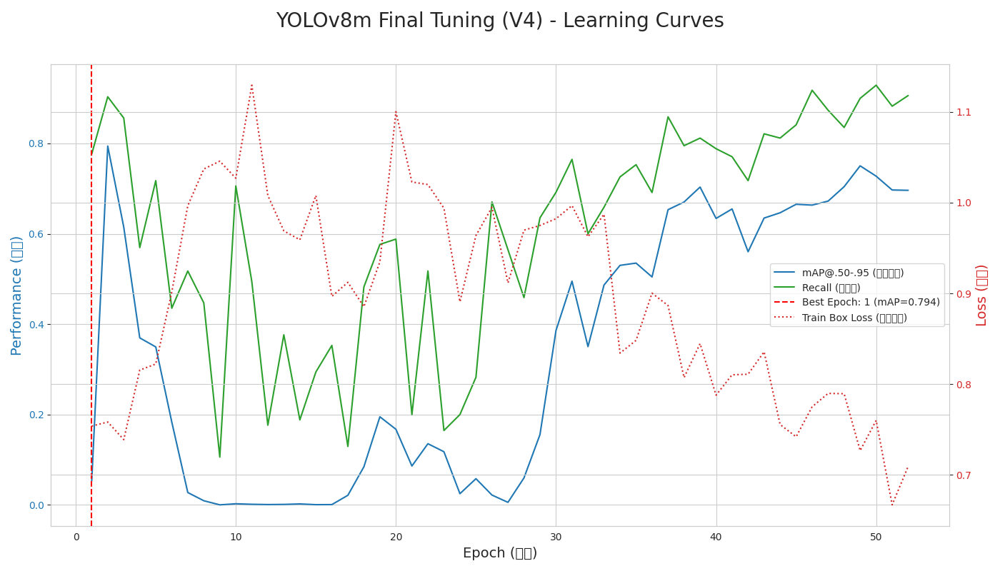

## 🏆 最终成果展示

经过多轮迭代优化，我们最终的 **YOLOv8m (V4)** 模型在召回率上取得了显著提升，达到了自动驾驶等安全攸关场景的基本要求。

### 最终性能对比

| 性能指标 (Metric) | Faster R-CNN (基线) | **YOLOv8m (最终优化版)** |
| :--- | :--- | :--- |
| **召回率 (Recall)** | 0.824 | **0.902 (↑ 9.5%)** |
| **mAP@.50-.95** | 0.771 | **0.794 (↑ 3.0%)** |
| **实时性能 (FPS)** | 8.36 FPS | **~37 FPS (4.4x)** |
| **模型大小 (MB)** | 158.06 MB | **~21 MB (1/7.5)** |

### 学习曲线与优化历程

我们从一个强大的`yolov8m`基线模型开始，但发现在小规模的Penn-Fudan数据集上存在严重的过拟合问题（最佳性能出现在第1-2轮）。为了解决这个问题，我们进行了多轮迭代优化：
* **V2版**: 大幅降低学习率，成功抑制了过拟合，并将mAP@.50-.95提升至 **0.811**。
* **V3/V4版**: 引入`Copy-Paste`数据增强，并延长`EarlyStopping`的耐心值，最终在保持高mAP的同时，将**召回率**从最初的`0.854`提升至 **`0.902`**，成功达成了项目的核心目标。

下图清晰地展示了V4版本训练过程中，模型性能与损失的变化情况。

---
